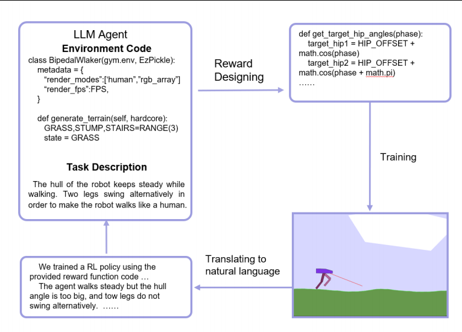

# Humanlike Bipedal Walker: LLM-Driven Reward Function Design for Natural Gait Learning

This repository contains the implementation code for our AIIIP conference paper on leveraging Large Language Models (LLMs) to design and optimize reward functions for humanlike bipedal locomotion.

## Abstract

Designing effective reward functions for complex robotic tasks like bipedal walking is traditionally a time-consuming, trial-and-error process requiring deep domain expertise. Engineers often spend weeks iterating on reward function components, manually tuning coefficients, and debugging unintended behaviors. This work presents a novel paradigm: **using Large Language Models (LLMs) as automated reward function designers**.

Our key insight is that LLMs possess rich knowledge about human biomechanics, natural gait patterns, and reinforcement learning principles. By prompting LLMs with high-level objectives like "design a reward function that makes the robot walk like a human," we can automatically generate sophisticated reward shaping strategies that would take human experts considerable time to develop.

## Methods: LLM-Driven Reward Function Design Process

### Overview

Rather than manually engineering reward functions, we employ an LLM (Claude/GPT-4) as an intelligent design assistant. The process follows an iterative refinement loop:

```
Human: "Design a reward function to make the bipedal walker move like a human"
  ↓
LLM: Proposes initial reward components based on biomechanical knowledge
  ↓
Training: Agent trained with LLM-designed reward
  ↓
Analysis: Observe agent behavior (hopping? asymmetric gait? falling?)
  ↓
Human: "The agent is hopping instead of walking smoothly"
  ↓
LLM: Identifies issue, proposes airborne penalty and gait continuity rewards
  ↓
[Repeat until satisfactory humanlike gait achieved]
```



## Results

https://github.com/user-attachments/assets/e711dfa5-5380-4f4d-9306-2a9d4e0dfc42

## Preparation

### Environment Setup

Follow these steps to set up the training environment:

#### 1. Create Conda Virtual Environment

```bash
# Create a new conda environment with Python 3.9
conda create -n bipedal_walker python=3.9

# Activate the environment
conda activate bipedal_walker
```

#### 2. Install Dependencies

The project requires Box2D physics engine and several RL libraries. Install them in the following order:

```bash
# Install SWIG (required for Box2D)
# On Ubuntu/Debian:
sudo apt-get install swig

# On macOS:
brew install swig

# On Windows with conda:
conda install swig

# Install all Python packages from requirements.txt
pip install -r requirements.txt
```

### Project Structure

```
.
├── train.py                    # Main training script
├── env_wrapper.py          # Custom environment wrapper with curriculum learning
├── requirements.txt            # Python dependencies
├── ppo_bipedalwalker_logs/     # Training logs (created during training)
└── ppo_bipedalwalker_models/   # Saved models (created during training)
```

## Training

Once the environment is set up, start training with a single command:

```bash
python train.py
```

### Training Configuration

The training script is configured with the following default parameters:
- **Algorithm**: PPO (Proximal Policy Optimization)
- **Total timesteps**: 15,000,000
- **Parallel environments**: 20 (using SubprocVecEnv)
- **Evaluation frequency**: Every 5,000 steps
- **Early stopping**: Automatically stops when reward threshold (100,000) is reached

### Monitoring Training Progress

The training process logs metrics to TensorBoard. To visualize training progress:

```bash
# In a separate terminal, run:
tensorboard --logdir ppo_bipedalwalker_logs/

# Then open your browser and navigate to:
# http://localhost:6006/
```

You can monitor:
- Episode rewards over time
- Policy loss and value loss
- Learning rate schedule
- Custom reward components

### Saved Models

The training process saves two types of models:
1. **Best model** (`ppo_bipedalwalker_models/best_model.zip`): Automatically saved when evaluation reward improves
2. **Final model** (`ppo_bipedalwalker_models/ppo_bipedalwalker_new_curriculum_learning_7_11.zip`): Saved at the end of training

## Acknowledgments

This work builds upon:
- [Gymnasium](https://gymnasium.farama.org/) - Reinforcement learning environments
- [Stable-Baselines3](https://stable-baselines3.readthedocs.io/) - Reliable RL algorithm implementations
- [BipedalWalker-v3](https://gymnasium.farama.org/environments/box2d/bipedal_walker/) - The base environment
